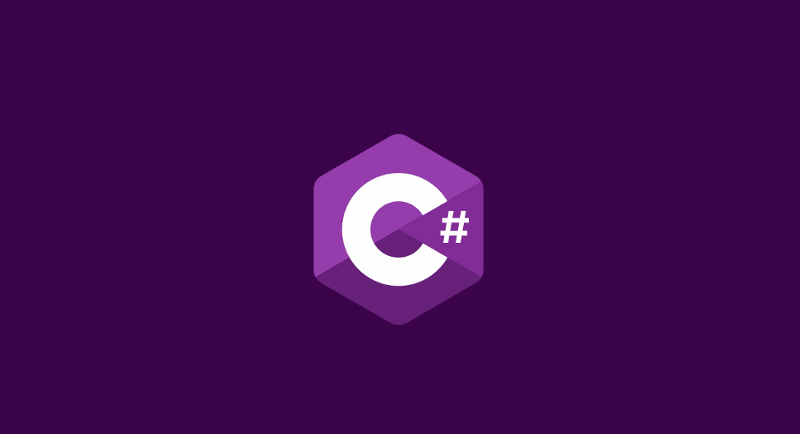

<h2 align="center">  C# Development Training  | .NET </h2>
<!-- https://shields.io/ -->

  
  </a>
    
  </a>

  

  

  </a>
    
  </a>

  </a>
    
  </a>

  </a>
    
  </a>

  </a>
    
  
  

[A tour of the C# language](https://docs.microsoft.com/en-us/dotnet/csharp/tour-of-csharp/)

<table align="center" >
  <tr>
    <td align="center" style="padding=0;width=50%;">
      
    </td>
  </tr>
</table>	   

## Table of Contents

| Numeration   | Check       | Stiker        |    Topic      |   Quantization   |    Edit Gitpot    |    Downloads    |  link  |
| ------------ |-------------|-------------- |----------------- |------------------ |---------------- |-------------- |------------- |
|  001   |:heavy_check_mark: | | [C Sharp](#C-Sharp)   |     | 💻 | 💾 | [ ⬅️ back](https://github.com/BrianMarquez3)| 
|  002   |:heavy_check_mark: | | [Microsoft .NET](#Microsoft-NET)   |     | 💻 | 💾 | [ ⬅️ back](https://github.com/BrianMarquez3)| 

---

## Intall

_Herramientas necesarias_

<!-- <table align="center">
  <tr>
    <td align="center" style="padding=0;width=50%;">
      
      <h5>Multiparadigma: estructurado, imperativo, orientado a objetos, dirigido por eventos, funcional, genérico, reflexivo</h5>
    </td>
  </tr>
</table> -->

⚙️ [Microsoft Azure](https://azure.microsoft.com/es-es/) - Cree, implemente y administre aplicaciones en varias nubes, en el entorno local y en el perímetro.  
📦 [Visual Studio IDE](https://visualstudio.microsoft.com/es/) - Crear el futuro con Visual Studio.  
📦 [JET RIDER .NET IDE](https://www.jetbrains.com/rider/) El IDE .NET multiplataforma de JetBrains.  
📦 [Visual Studio Code](https://code.visualstudio.com/) - Code Editing. Redefined 
📦 [SQL SERVER](https://www.microsoft.com/es-es/sql-server/sql-server-downloads) - Probar SQL Server en el entorno local o en la nube.  
📦 [Postman](https://www.postman.com/) - Postman API Platform  

_Download .NET SDK_

📦 [Download .NET](https://dotnet.microsoft.com/en-us/download) - Free. Cross-platform. Open source.  
📦 [.NET 7.0](https://dotnet.microsoft.com/en-us/download/dotnet/7.0) - Download .NET 7.0  
📦 [.NET 6.0](https://dotnet.microsoft.com/en-us/download/dotnet/6.0) - Download .NET 6.0  
📦 [.NET 5.0](https://dotnet.microsoft.com/en-us/download/dotnet/5.0) - Download .NET 5.0  
📦 [.NET 3.0](https://dotnet.microsoft.com/en-us/download/dotnet/3.0) - Download .NET 3.0  

---

## Books

<table>
  <tr>
      <td>Server</td>
      <td>Name</td>
      <td>Authors</td>
      <td>Editorial</td>
      <td>ISBN</td>
      <td>Link</td>
  </tr>

   <tr>
      <td>OneDrive</td>
      <td>JEnterprise Application Development with C# 9 and .NET 5: Enhance your C# and .NET skills by mastering the process of developing professional-grade web applications</td>
      <td>Ravindra Akella, Arun Kumar Tamirisa, Suneel Kumar Kunani, Bhupesh Guptha Muthiyalu </td>
      <td>Packt</td>
      <td>978-1800209442</td>
      <td><></a></td>
  </tr>

</table>

---
## Learning C++
	   
<table align="center">
  <tr>
    <td align="center" style="padding=0;width=50%;">
      
    </td>
  </tr>
</table> 
	   
	   
🏫 Link de Entrenamiento [Learn C++ Object Oriented Programming - 0 to Hero 🦸‍♂️](https://github.com/BrianMarquez3/C-Plus-Plus-Course)

---

## Indice TIOBE

El índice de la comunidad de programación TIOBE es un indicador de la popularidad de los lenguajes de programación. 
El índice se actualiza una vez al mes. Las calificaciones se basan en la cantidad de ingenieros calificados en todo el mundo, 
cursos y proveedores externos. Los motores de búsqueda populares como Google, Bing, Yahoo !, Wikipedia, Amazon, YouTube y 
Baidu se utilizan para calcular las calificaciones. 
Es importante tener en cuenta que el índice TIOBE no se trata del mejor lenguaje de 
programación o del lenguaje en el que se han escrito la mayoría de las líneas de código .

[Indice TIOBE](https://www.tiobe.com/tiobe-index/)

## Licence 

Todo acerca de la licencia [here](https://github.com/BrianMarquez3/Learning-Java/blob/main/LICENCE)

---

 <table align="center">
    <tr>
      <td colspan="3">A</td>
        <td>B</td>
      </tr>
      <tr>
        <td>C</td>
      <td colspan="2"></td>
        <td>E</td>
      </tr>
      <tr>
      <td colspan="3">F</td>
        <td>G</td>
    </tr>
</table>

